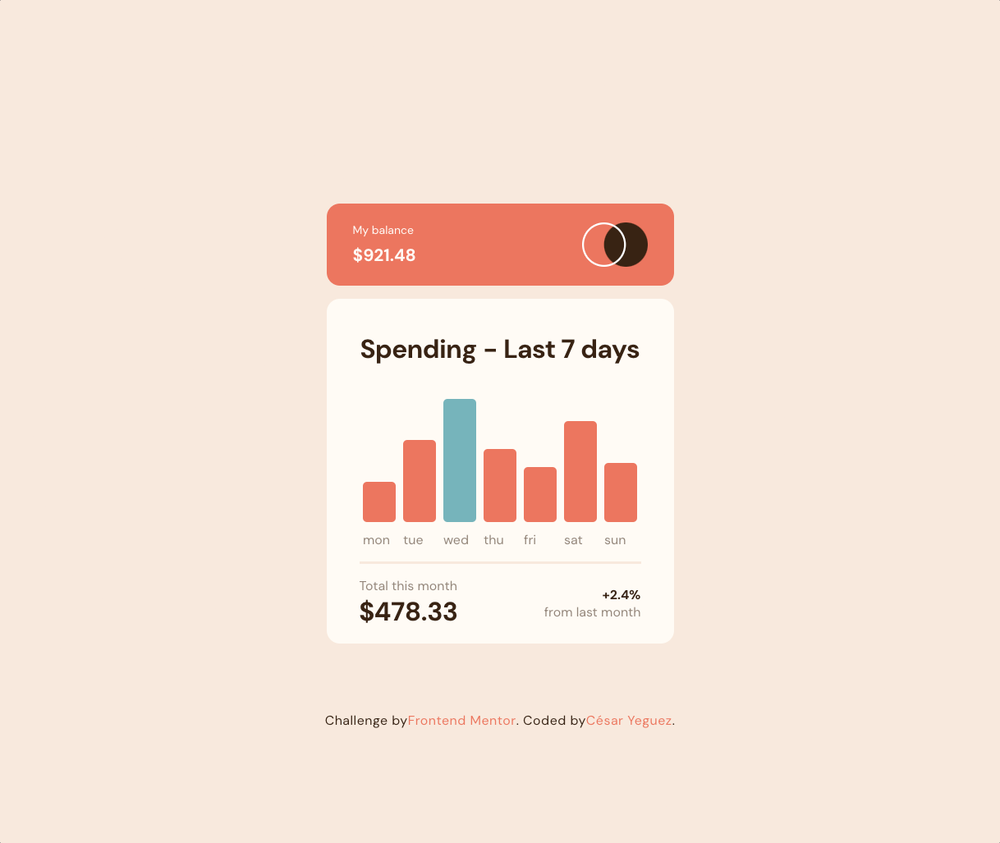
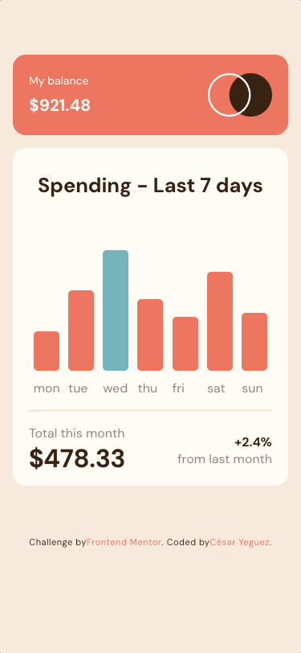

# Frontend Mentor - Interactive card details form

 Hello!! 🤟🤟, welcome to my repo, thanks for stopping by here.

This is a solution to the [Expenses chart component challenge on Frontend Mentor](https://www.frontendmentor.io/challenges/expenses-chart-component-e7yJBUdjwt)
## Table of contents

- [Overview](#overview)
  - [The challenge](#the-challenge)
  - [Screenshot](#screenshot)
  - [Links](#links)
- [My process](#my-process)
  - [Built with](#built-with)
  - [What I learned](#what-i-learned)
  - [Author](#author)


## Overview


The challenge is to build this bar chart component and make it look as close to the layout as possible. 🏁

### The challenge

The challenge is to dynamically generate a bar chart with data obtained from a local .json file.


### Screenshot





### Links
<a href="https://cyeguez.github.io/interactive-card-details-form-main/" target="_blank"></a>


		
## My process
-  I configure the project architecture . 🏛️
- I clean the HTML of Comments and styles. 🧹
- I assign the HTML tags. 🎯
- I write the styles, I configure mediaquerys. 🕶️
- I create the logical part in JS. 🧠


### Built with

 
  
  
   
  

		


### What I learned


This project forced me to read regular expressions.

```
 inputMonth.value = inputMonth.value.replace(/\s/g, "");
```


## Author

- Website - [César Yeguez](https://github.com/cyeguez) 👋
- Frontend Mentor - [@cyeguez](https://www.frontendmentor.io/profile/cyeguez)👇


